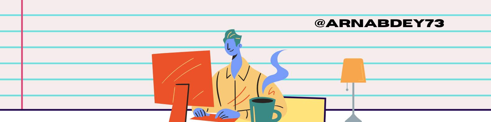

<header class="main-banner">
  
</header>

<section id="insights">
  <h2>Insights</h2>
  <ul>
    <li><a href="https://codemyinfra.hashnode.dev/devops-python-automation-azure-kubernetes">DevOps Automation Guide →</a></li>
    <li><a href="/blog/azure-cost-optimization">Azure Cost Optimization Tips →</a></li>
  </ul>
</section>

<section id="cta-footer" class="center">
  
Ready to streamline your cloud operations? <a href="/contact">Let’s chat →</a>

</section>
