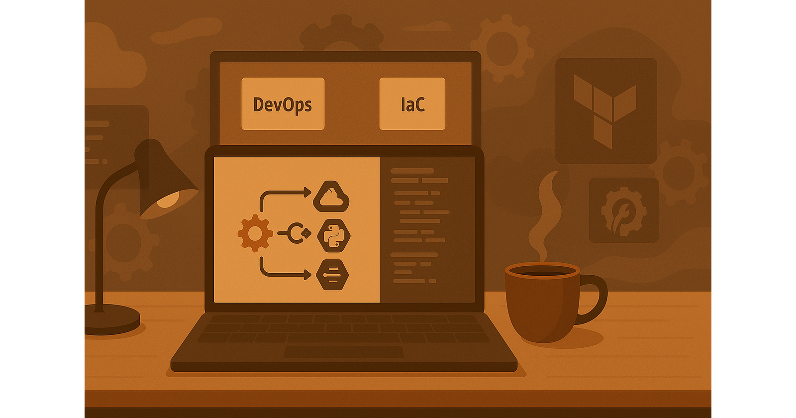

<header style="text-align: center;">
  
</header>

<header>
    <h1>Arnab Dey</h1>
    
Cloud & DevOps Engineer | Freelancer | Open Source Contributor

</header>

<section id="about">
    <h2>About Me</h2>
    

        An accomplished Senior Cloud DevOps Engineer with 8+ years of experience in public cloud environments (14+ years in IT). Proven expertise in optimizing CI/CD pipelines for high-quality deployments on public and hybrid cloud platforms. Strong problem solver with a focus on performance monitoring, cloud security, and promoting DevOps best practices.
        <li>Skilled in Azure DevOps, Jenkins, Kubernetes, Docker, GitHub, GitHub Actions, Ansible, and Terraform.</li>
        <li>Proficient in scripting with Bash, Python, and PowerShell for automated infrastructure management.</li>
        <li>Experienced in the SAFe framework and Product Owner roles, aligning product vision with stakeholder needs.</li>
    

</section>

<section id="skills">
    <h2>Skills & Expertise</h2>
    <ul>
        <li>Cloud Platforms: Azure, AWS, OpenStack</li>
        <li>CI/CD Tools: Azure DevOps, Jenkins, GitLab CI, GitHub Actions</li>
        <li>Orchestration & Containerization: Kubernetes, Docker, Rancher</li>
        <li>Configuration Management: Ansible</li>
        <li>Scripting Languages: Bash, Python, PowerShell</li>
        <li>Monitoring & Logging: Prometheus, Grafana, Azure Monitor, ELK Stack (Elasticsearch, Logstash, Kibana)</li>
    </ul>
</section>

<section id="projects">
    <h2>Projects</h2>
    <ul>
        <li><a href="https://github.com/arnabdey73/devops-python-automation-project">Project 1 - Cloud Infrastructure Automation</a></li>
        <li><a href="https://github.com/arnabdey73/personal-expense-tracker">Project 2 - Personal Expense Tracker(PCEP)</a></li>
        <li><a href="https://github.com/arnabdey73/triforce-first">Project 3 - Triforce Implementation</a></li>
    </ul>
</section>

<section id="contact">
    <h2>Contact</h2>
    
Email: <a href="mailto:arnabdey009@gmail.com">arnabdey009@gmail.com</a>

    
GitHub: <a href="https://github.com/arnabdey73">github.com/arnabdey73</a>

    
LinkedIn: <a href="https://linkedin.com/in/arnabdey73">linkedin.com/in/arnabdey73</a>

</section>

<footer>
    
&copy; 2025 Arnab Dey. All rights reserved.

</footer>
